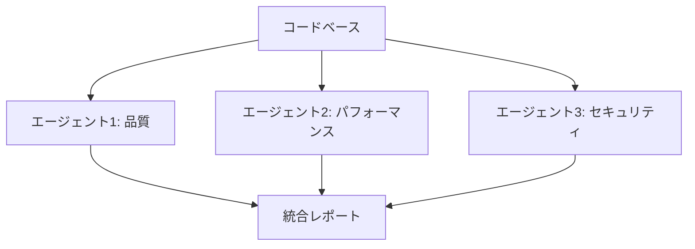

# コードレビューとバグ修正ワークフロー

## 概要

大規模なコードベースを複数の観点から並行レビューし、問題を修正するワークフロー。

**想定時間**: 各エージェント 10-20分

## タスク分割

### エージェント1: コード品質レビュー

**タスク内容**:
```
コードの品質面をレビューしてください。

【レビュー対象】
{対象ディレクトリまたはファイルパス}

【レビュー観点】
1. コードの可読性
   - 命名規則の適切性
   - コメントの充実度
   - 関数の複雑度

2. 保守性
   - DRY原則の遵守
   - 適切な責任分離
   - モジュール化

3. TypeScript/型の使用
   - 型定義の適切性
   - any型の使用状況
   - 型安全性

【成果物】
- レビュー結果レポート (dist/evaluations/{timestamp}-quality-review.md)
- 推奨される修正リスト
- 修正が必要な場合は修正実施
```

**成果物**:
- dist/evaluations/{timestamp}-quality-review.md
- 修正済みコード（必要な場合）

---

### エージェント2: パフォーマンスレビューと最適化

**タスク内容**:
```
パフォーマンス面をレビューして最適化してください。

【レビュー対象】
{対象ディレクトリまたはファイルパス}

【レビュー観点】
1. パフォーマンスボトルネック
   - 不必要な再レンダリング
   - 重い計算処理
   - メモリリーク

2. 最適化機会
   - useMemo/useCallbackの適切な使用
   - 遅延ロード
   - コード分割

3. バンドルサイズ
   - 不要な依存関係
   - tree-shaking の機会

【成果物】
- パフォーマンスレビューレポート (dist/evaluations/{timestamp}-performance-review.md)
- 最適化の実施（可能な場合）
- ベンチマーク結果
```

**成果物**:
- dist/evaluations/{timestamp}-performance-review.md
- 最適化済みコード
- パフォーマンス測定結果

---

### エージェント3: セキュリティレビュー

**タスク内容**:
```
セキュリティ面をレビューしてください。

【レビュー対象】
{対象ディレクトリまたはファイルパス}

【レビュー観点】
1. OWASP Top 10 の確認
   - XSS脆弱性
   - SQLインジェクション
   - CSRF対策
   - 認証・認可の適切性

2. セキュアコーディング
   - ユーザー入力の検証
   - エスケープ処理
   - センシティブ情報の扱い

3. 依存関係のセキュリティ
   - 既知の脆弱性
   - 古いパッケージ
   - npm audit 結果

【成果物】
- セキュリティレビューレポート (dist/evaluations/{timestamp}-security-review.md)
- 脆弱性リスト
- 修正が必要な場合は修正実施
```

**成果物**:
- dist/evaluations/{timestamp}-security-review.md
- 修正済みコード（必要な場合）
- npm audit 結果

---

## 依存関係



- 3つのエージェントは完全に並行処理可能
- 各レビュー結果を統合して総合レポートを作成

## 期待される成果

**最終成果物**:
- 3つの観点からの詳細レビューレポート
- 修正済みコード
- 改善推奨リスト

**品質基準**:
- すべての重大な問題が特定されている
- 可能な修正は実施済み
- 修正後もテストが通る

## 実行例

```bash
# 対象ディレクトリを指定
TARGET_DIR="src/components"

# ボスとして実行する場合
./send-message.sh エージェント1 "上記エージェント1のタスク内容（TARGET_DIR=${TARGET_DIR}）"
./send-message.sh エージェント2 "上記エージェント2のタスク内容（TARGET_DIR=${TARGET_DIR}）"
./send-message.sh エージェント3 "上記エージェント3のタスク内容（TARGET_DIR=${TARGET_DIR}）"
```

## 完了確認

各エージェントから完了報告を受けたら、以下を確認:
- [ ] 3つのレビューレポートが作成されている
- [ ] 重大な問題がすべて特定されている
- [ ] 可能な修正は実施済み
- [ ] テストがすべて通る
- [ ] 統合レポートにまとめる

## 後続タスク

レビュー完了後:
1. 統合レポートを作成
2. 未修正の問題を Issue 化
3. PRコメントとして投稿（該当する場合）
