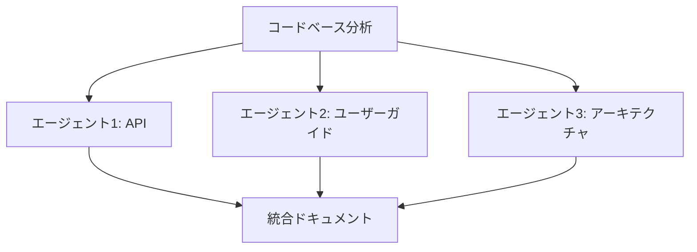

# ドキュメント生成ワークフロー

## 概要

プロジェクトの包括的なドキュメントを複数の観点から並行生成するワークフロー。

**想定時間**: 各エージェント 15-30分

## タスク分割

### エージェント1: APIドキュメント生成

**タスク内容**:
```
APIドキュメントを生成してください。

【対象コードベース】
{プロジェクトパス}

【具体的なタスク】
1. コードベースを分析
   - すべてのpublic API/関数を特定
   - パラメータと戻り値を確認
   - 既存のJSDocコメントを確認

2. APIドキュメント生成
   - 各API/関数の説明
   - パラメータの型と説明
   - 戻り値の型と説明
   - 使用例（コードサンプル）
   - エラーハンドリング

3. 出力形式: Markdown
   - dist/outputs/{timestamp}-docs/api/README.md
   - dist/outputs/{timestamp}-docs/api/{module}.md

【重要】
- コードサンプルは動作確認済みのものを記載
- 型定義を正確に記載
```

**成果物**:
- dist/outputs/{timestamp}-docs/api/README.md
- dist/outputs/{timestamp}-docs/api/*.md

---

### エージェント2: ユーザーガイド作成

**タスク内容**:
```
エンドユーザー向けのガイドを作成してください。

【対象プロジェクト】
{プロジェクトパス}

【具体的なタスク】
1. プロジェクト概要
   - 何ができるか
   - 主な機能
   - 対象ユーザー

2. Getting Started
   - インストール手順
   - 初期設定
   - 基本的な使い方

3. 機能ガイド
   - 各機能の詳細説明
   - スクリーンショット（必要に応じて）
   - ユースケース

4. トラブルシューティング
   - よくある問題と解決方法
   - FAQ

【出力先】
- dist/outputs/{timestamp}-docs/user-guide/README.md
- dist/outputs/{timestamp}-docs/user-guide/getting-started.md
- dist/outputs/{timestamp}-docs/user-guide/features.md
- dist/outputs/{timestamp}-docs/user-guide/troubleshooting.md

【重要】
- 初心者にも分かりやすい説明
- 具体例を多く含める
```

**成果物**:
- dist/outputs/{timestamp}-docs/user-guide/*.md

---

### エージェント3: アーキテクチャドキュメント作成

**タスク内容**:
```
技術アーキテクチャとデザインドキュメントを作成してください。

【対象プロジェクト】
{プロジェクトパス}

【具体的なタスク】
1. アーキテクチャ概要
   - システム構成図（Mermaid図）
   - 技術スタック
   - デザインパターン
   - ディレクトリ構造

2. データフロー
   - データの流れ（Mermaid図）
   - State管理
   - API通信

3. 主要コンポーネント
   - 各コンポーネントの責務
   - コンポーネント間の関係
   - 依存関係図

4. 開発者向け情報
   - コーディング規約
   - テスト戦略
   - デプロイメント手順
   - 開発環境セットアップ

【出力先】
- dist/outputs/{timestamp}-docs/architecture/README.md
- dist/outputs/{timestamp}-docs/architecture/system-design.md
- dist/outputs/{timestamp}-docs/architecture/data-flow.md
- dist/outputs/{timestamp}-docs/architecture/components.md
- dist/outputs/{timestamp}-docs/architecture/development.md

【重要】
- Mermaid図を活用
- 技術的詳細を正確に記載
```

**成果物**:
- dist/outputs/{timestamp}-docs/architecture/*.md
- Mermaid図を含むドキュメント

---

## 依存関係



- 3つのエージェントは完全に並行処理可能
- 各ドキュメントは独立しているが、相互参照可能

## 期待される成果

**最終成果物**:
```
dist/outputs/{timestamp}-docs/
├── README.md (統合インデックス)
├── api/
│   ├── README.md
│   └── *.md
├── user-guide/
│   ├── README.md
│   ├── getting-started.md
│   ├── features.md
│   └── troubleshooting.md
└── architecture/
    ├── README.md
    ├── system-design.md
    ├── data-flow.md
    ├── components.md
    └── development.md
```

**品質基準**:
- すべてのドキュメントがMarkdown形式
- リンクがすべて有効
- Mermaid図が正しくレンダリングされる
- コードサンプルが動作する
- 初心者でも理解できる

## 実行例

```bash
# プロジェクトパスを指定
PROJECT_PATH="."

# ボスとして実行する場合
./send-message.sh エージェント1 "上記エージェント1のタスク内容（PROJECT_PATH=${PROJECT_PATH}）"
./send-message.sh エージェント2 "上記エージェント2のタスク内容（PROJECT_PATH=${PROJECT_PATH}）"
./send-message.sh エージェント3 "上記エージェント3のタスク内容（PROJECT_PATH=${PROJECT_PATH}）"
```

## 完了確認

各エージェントから完了報告を受けたら、以下を確認:
- [ ] 3種類のドキュメントがすべて生成されている
- [ ] Markdownが正しくフォーマットされている
- [ ] リンクがすべて有効
- [ ] Mermaid図が正しく表示される
- [ ] コードサンプルが動作する

## 後続タスク

ドキュメント生成完了後:
1. 統合READMEを作成（各ドキュメントへのリンク）
2. GitHub Pagesやドキュメントサイトにデプロイ
3. プロジェクトのメインREADMEからリンク
