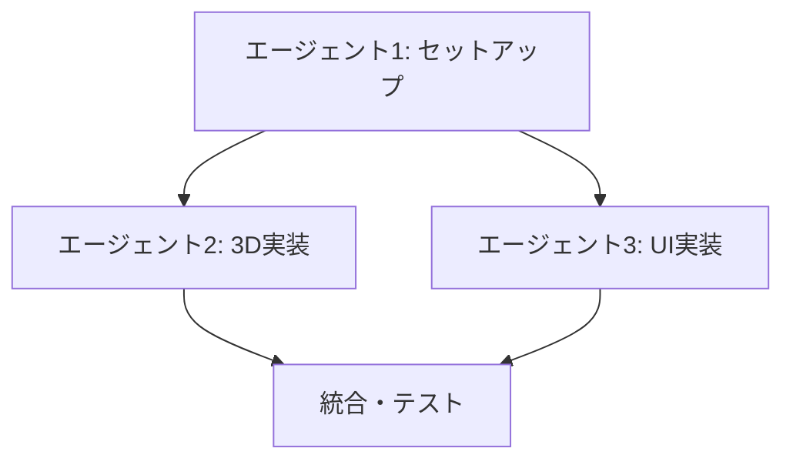

# Three.js 3D可視化ページ作成ワークフロー

## 概要

Three.jsを使った3Dビジュアライゼーションページを作成するための並行処理ワークフロー。

**想定時間**: 各エージェント 15-30分

## タスク分割

### エージェント1: プロジェクトセットアップとデータモデル設計

**タスク内容**:
```
Next.jsプロジェクトのセットアップとデータモデル設計を行ってください。

【作業ディレクトリ】
dist/outputs/{timestamp}-three-js-visualization/

【具体的なタスク】
1. Next.js + TypeScriptプロジェクトを作成
2. 必要な依存関係をインストール:
   - three, @types/three
   - @react-three/fiber, @react-three/drei
   - tailwindcss
3. データモデルの型定義を作成 (types/index.ts)
4. サンプルデータを作成 (data/sampleData.ts)
5. プロジェクト構造とセットアップ手順をREADME.mdに記載

【重要】
- エラーが出ないようにすべての設定を完了
- 他のエージェントが参照できるようにREADME.mdを詳しく記載
```

**成果物**:
- Next.jsプロジェクトの基本構造
- types/index.ts
- data/sampleData.ts
- README.md

---

### エージェント2: 3Dビジュアライゼーション実装

**タスク内容**:
```
Three.jsを使った3Dビジュアライゼーション機能を実装してください。

【作業ディレクトリ】
dist/outputs/{timestamp}-three-js-visualization/

【具体的なタスク】
1. エージェント1のセットアップ完了を待つ（10秒待機）
2. Three.jsコンポーネントを作成:
   - 3D棒グラフまたは3D散布図
   - インタラクティブ機能（マウスホバー、ドラッグ回転）
3. カメラコントロールとライティングの設定
4. レスポンシブ対応
5. アニメーション効果

【技術仕様】
- @react-three/fiber と @react-three/drei を使用
- components/3d/ ディレクトリに配置
- propsでデータを受け取る設計

【重要】
- かっこいい3Dエフェクトを追加
```

**成果物**:
- components/3d/Visualization3D.tsx
- components/3d/Scene.tsx
- components/3d/Controls.tsx

---

### エージェント3: UI実装と統合

**タスク内容**:
```
UI実装とコンポーネント統合を行ってください。

【作業ディレクトリ】
dist/outputs/{timestamp}-three-js-visualization/

【具体的なタスク】
1. エージェント1のセットアップ完了を待つ（10秒待機）
2. メインページ (app/page.tsx) の実装:
   - ヘッダー: タイトル、説明
   - コントロールパネル: データ選択、表示設定
   - 3Dグラフ表示エリア（エージェント2のコンポーネント使用）
   - サマリー表示
3. UIデザイン:
   - Tailwind CSSでモダンなデザイン
   - ダークモード対応
   - レスポンシブデザイン
4. データ連携とstate管理

【重要】
- 使いやすいUIデザイン
- エージェント2のコンポーネントを適切に統合
```

**成果物**:
- app/page.tsx
- components/ui/ControlPanel.tsx
- components/ui/Header.tsx
- styles/

---

## 依存関係



- エージェント2、3はエージェント1のセットアップ完了後に開始
- エージェント2、3は並行処理可能

## 期待される成果

**最終成果物**:
- 完全に動作するThree.js 3D可視化Webアプリケーション
- インタラクティブな3Dグラフ
- レスポンシブ対応UI
- ダークモード対応

**品質基準**:
- TypeScriptエラーなし
- ビルド成功
- 3Dレンダリングが正常に動作
- UI/UXが直感的

## 実行例

```bash
# ボスとして実行する場合
./send-message.sh エージェント1 "上記エージェント1のタスク内容をコピー"
./send-message.sh エージェント2 "上記エージェント2のタスク内容をコピー"
./send-message.sh エージェント3 "上記エージェント3のタスク内容をコピー"
```

## 完了確認

各エージェントから完了報告を受けたら、以下を確認:
- [ ] プロジェクトがビルドできる
- [ ] 3Dグラフが正しく表示される
- [ ] インタラクション（回転、ズーム）が動作する
- [ ] UIが適切に表示される
- [ ] README.mdが完備されている
